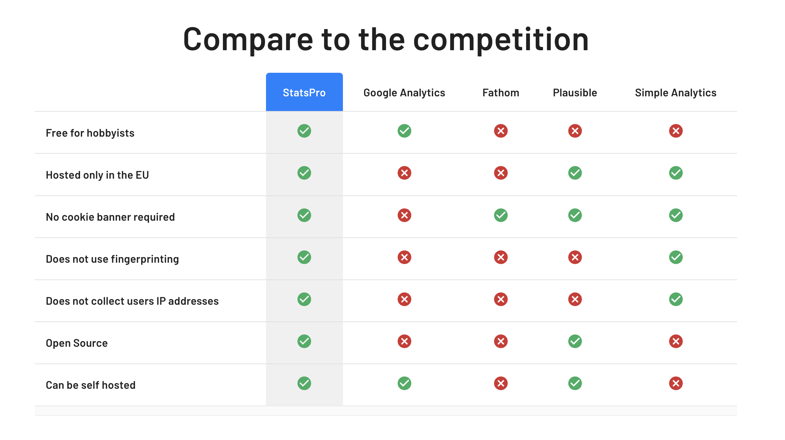

# Marble Metrics

<p align="center">
    <a href="https://marblemetrics.com/">
        
    </a>
</p>

[Marble Metrics](https://marblemetrics.com) is an simple, open-source, easily deployable, and privacy friendly web analytics software. Marble Metrics has many of the features that you would expect from other analytics software without invading your users privacy and without selling data to 3rd parties for advertisements. 

**Marble Metrics does not use cookies and is fully compliant with GDPR, PECR, CCPA.**

You can run Marble Metrics on your own servers (by following the instructions below) or have us host it for you. We only host on European servers owned by European companies to ensure your analytics is compliant with the law.  

### Choosing Marble Metrics
  

Learn more about why you should choose Marble Metrics over other analytics providers on our [website here](https://marblemetrics.com).

### Architecture

#### Broadcaster
The Broadcaster is the javascript file which is installed on your website to collect pageview data when users visit your site. It is designed to be as lightweight and un-intrusive as possible.

#### Backend
The Backend of the application is written in Laravel, a modern framework that makes it easy to write complex services.

One of the most important parts of the backend is The Collector. The Collector records the data from Broadcasters into a Postgres database.

#### Frontend
The frontend of the application is written in React, allowing a clean separation between the backend and frontend application.

### Running Locally
The steps below outline how you can run Marble Metrics on your own machine. If you don't want to deal with running Marble Metrics on your own, [we can handle it for you](https://marblemetrics.com).

These steps have been tested on Mac OS X 12.5.

#### Prerequisites
* Docker
* Understanding of command line utilities
* Understanding of modern frontend development with React
* Basic understanding of Laravel.

#### Steps
1. Run this command to start containers to run nginx, the Marble Metics app, and Postgres
    ```bash
    make rebuild-local
    ```
2. Manually connect to the database with username `postgres` and password `postgres` create a `marble_metrics` database.
3. Now you'll need to SSH into the app container to install all Javascript and PHP dependencies and run our Vite server. This will compile and serve up our frontend resources.
    ```bash
    docker-composer exec app /bin/bash
    cd src
    composer install
    npm install
    npm run dev
    ```
   
4. Now you should be able to visit `localhost` to see Marble Metrics running.
5. Next, we'll run migrations on the database to get all the tables setup. While SSHed into the container, run
    ```bash
    php artisan migrate
    ```

### Running In The Cloud
Marble Metrics is hosted on Stackhero, a European company which has servers in Europe. This guide assumes you will be running on Stackhero. Marble Metrics should run the same on other docker cloud providers but there may be some work to get it all configured. If you don't want to deal with running Marble Metrics on your own, [we can handle it for you](https://marblemetrics.com).

#### 
Marble Metrics is deployed to Stackhero using Github Actions.

1. Create a new Docker service within Stackhero. Keep the host, service ID, and certificates password handy as we'll be using them in a later step.

2. Create a new Postgres service within Stackhero. Keep the host, username, and password handy as well be using them in a later step. Manually connect to the database and create a `marble_metrics` database.

3. Setup Github Actions environment variables
    * STACKHERO_DOCKER_HOST - set this to the value provided by Stackhero
    * STACKHERO_DOCKER_SERVICE_ID - set this to the value provided by Stackhero
    * STACKHERO_DOCKER_CERTIFICATES_PASSWORD - set this to the value provided by Stackhero
    * DOT_ENV - this will populate the .env to be used by the application, it should contain
    ```
    APP_ENV=staging
    APP_KEY=base64:<your app key here>
    APP_DEBUG=false
    APP_URL=<your STACKHERO_DOCKER_HOST>
    VITE_APP_URL=<your STACKHERO_DOCKER_HOST>
    
    DB_HOST=<your postgres database host>
    DB_PORT=5432
    DB_DATABASE=marble_metrics
    DB_USERNAME=<your postgres username>
    DB_PASSWORD=<your postgres password>
   
   GOOGLE_CLIENT_ID=<optional, google client id for Signin With Google>
   GOOGLE_CLIENT_SECRET=<optional, google client secret for Signin With Google>
    ```
    Replace the values in triangle brackets with the appropriate values.
   
    `<your app key here>` should be a random base-64 encoded string of length 32
     
3. Now go to Github Actions and run the Build Staging action.
4. One the action has finished running, you should be able to see Marble Metrics running by visiting the docker host URL.         

### License
Marble Metrics is open source under the GNU Affero General Public License Version 3 (AGPLv3).

[License](LICENSE.md)